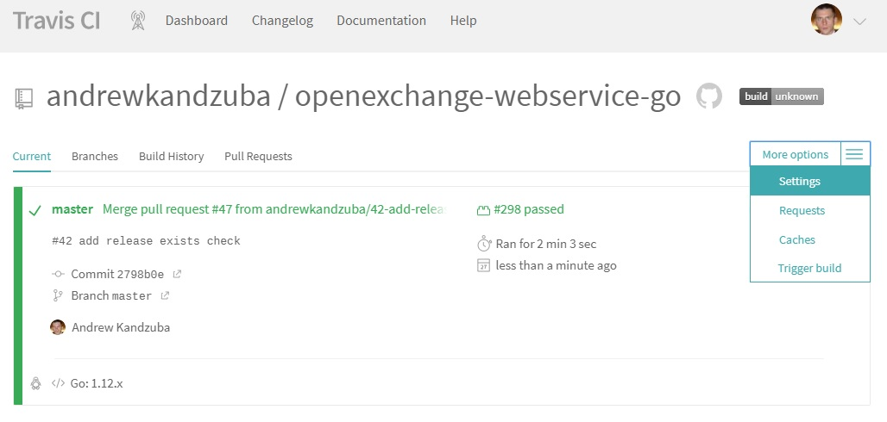
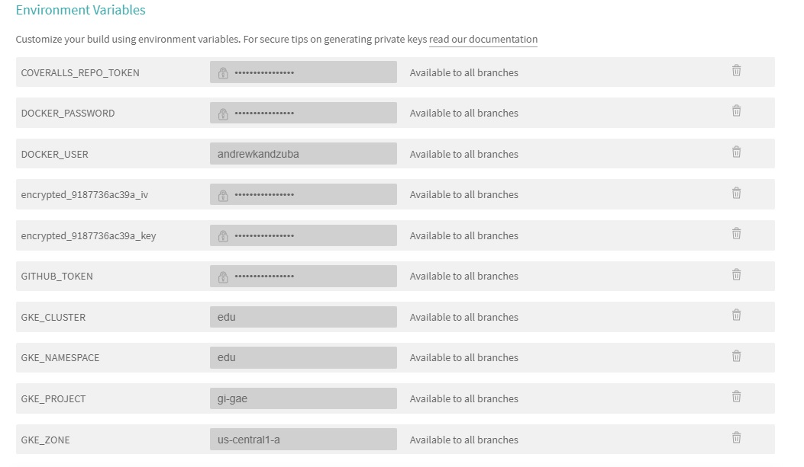
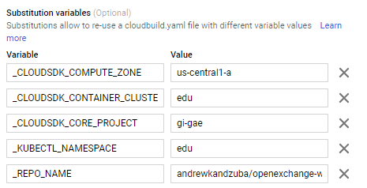
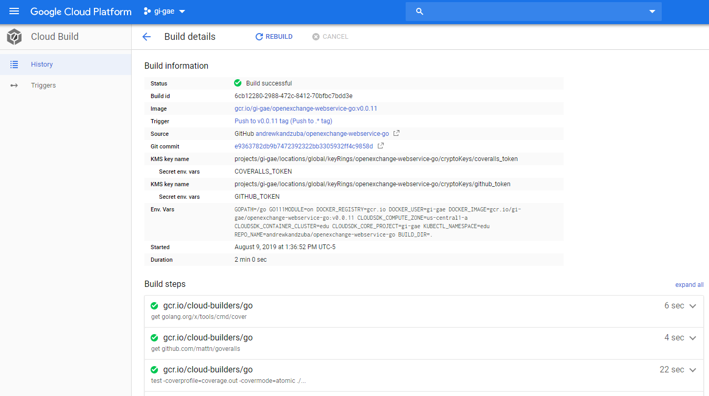

[](https://github.com/andrewkandzuba/openexchange-webservice-go/releases) [](https://github.com/andrewkandzuba/openexchange-webservice-go/releases) [](https://github.com/sbsends/cloud-build-badge) [](https://coveralls.io/github/andrewkandzuba/openexchange-webservice-go?branch=master)

# Introduction 

Developing WebService in Golang! Inspired by Marko Luksa "Kubernetes in Action".

## Chapter 1. Manual build and deploy.

### 1.1. Build docker image 

- Build Docker image
  - Run build script: `$build/docker_build.sh`
  - Check for new Docker image: `$docker images | grep webservice`
- Run container: `$docker run --name webservice-container -p 8080:8080 -d webservice`
  - Hit in a browser: `localhost:8080`
  - Alternatively run: `curl -v -i localhost:8080`
  
#### 1.2. Deploy to Google Kubernetes Engine (GKE)

- Optional. If you run behind a corporate proxy set following environment variables as FQND resources with authorization:
 - HTTP_PROXY 
 - HTTPS_PROXY 

- Create new cluster in GKE: 
```bash
$ gcloud container clusters create edu --machine-type=f1-micro --num-nodes=3 --zone=us-central1-a 
``` 
- Optional. Create dedicated namespace and switch local context:
    - `kubectl create -f documentation/edu-namespace.yaml`
    - `kubectl config set-context $(kubectl config current-context) --namespace=edu-namespace`    
- Login docker to remote registry like Docker Hub. In my case it is [andrewkandzuba](https://cloud.docker.com/repository/docker/andrewkandzuba)` 
- Run deployment script ending with the image name in Docker Registry.
```bash
$ sed -e "s|$DOCKER_IMAGE|$DOCKER_IMAGE|g" deployment.yaml | kubectl apply -f -
```  
Note: 
 - **DOCKER_IMAGE** - should contains full name i.e. `<HOST>/<USER>/<IMAGE_NAME>(:<TAG>)`. In CI integrations this value is being calculated automatically.

#### 1.3. Health check

- Wait until after service **webservice** receives EXTERNAL-IP:
```bash
$ kubectl get svc -n edu-namespace
NAME         TYPE           CLUSTER-IP      EXTERNAL-IP     PORT(S)          AGE
webservice   LoadBalancer   10.55.254.157   35.184.166.36   8080:30553/TCP   2m
```
- Hit in a browser: `<EXTERNAL-IP>:8080`
- Alternatively run: `curl -v -i <EXTERNAL-IP>:8080` 

Additional handlers

- Liveness probe handler is available by `<EXTERNAL-IP>:8080/health`
- To restart container(s) randomly hit: `<EXTERNAL-IP>:8080/stop` 

## Chapter 2. Build and deploy with Travis CI. 

[Travis CI](https://docs.travis-ci.com/user/for-beginners/) is a Continuous Integration service that automates and facilitates 
collaborative development and deployment.

This project actively uses it to guaranty high quality of the delivery. All building stages are defined in [.travis.yml](.travis.yml) file. 

### 2.1. Technological stack

The build script itself exploits to following technologies and services:

- [Go Modules](https://github.com/golang/go/wiki/Modules) for dependencies versioned. 
- [Coverall](https://docs.coveralls.io/go) for tracking test code coverage. 
- [Docker](https://www.docker.com/) for building target images. 
- [Docker Hub](https://hub.docker.com/) for distributing docker images.
- [GoReleaser](https://goreleaser.com/) for deploying Github releases.
- [Google Cloud SDK](https://cloud.google.com/sdk/) for deploying services into Google Kubernetes Engine.

### 2.2. Configuring environment variables to the Travis CI build. 





Following environment variables are mandatory for any successful build: 

- **GITHUB_TOKEN** - it is a [personal access token](https://help.github.com/en/articles/creating-a-personal-access-token-for-the-command-line) you generate to let external clients to access the repo. Must be secure.
- **COVERALLS_REPO_TOKEN** - an access token [generated](https://docs.coveralls.io/api-introduction) by Coverall per connected repository. Must be secure.
- **DOCKER_USER** - your Docker Hub user name. Can be plain.
- **DOCKER_PASSWORD** - your Docker Hub password. Must be secure.
- **encrypted_XXX_key** and **encrypted_YYY_iv** - This is a little bit tricky. 
    - We use Google Cloud SDK service account authentication method [with key file](https://cloud.google.com/sdk/gcloud/reference/auth/activate-service-account) method to get access to the GKE cluster. 
    - The generated key file should be included into the project but in encrypted form. Travis CI supports [file encryption](https://docs.travis-ci.com/user/encrypting-files/) that greatly facilitates and simplify the solution.
    - Please refer to this example `travis encrypt-file super_secret.txt --add` to understand how the encryption works and how Travis populates these two environment variable.
- **CLOUDSDK_CORE_PROJECT** - the name of target Google Cloud Project.
- **CLOUDSDK_COMPUTE_ZONE** - the name of the target GCP cluster zone.
- **CLOUDSDK_CONTAINER_CLUSTER** - the name of the target GCP cluster. Note that the cluster must be precreated. See "_1.2. Deploy to Google Kubernetes Engine (GKE)_"
- **KUBECTL_NAMESPACE** - the target Kubernetes namespace. 
- **NOTIFY_EMAIL** - send build status to.

### 2.3. Tagging

By default deployment happens only for [tagged branches](https://goreleaser.com/).

## Chapter 3. Build and deploy with Google Cloud Build (GCB).

Prerequisites:

- Please get yourself familiar with GCB: https://cloud.google.com/cloud-build/docs/

### Build scripts.

GCB triggers your build either upon pushing into every branch or upon pushing new tag.

- [cloudbuild.yaml](cloudbuild.yaml) - GCB configuration that runs on every push. This includes only compilation and test coverage validations.
- [cloudbuild.release.yaml](cloudbuild.release.yaml) - GCB configuration that in addition includes publishing new release into the repo on github.com, pushing new docker images into Google Container Registry and deploying artifacts to Google Kubernetes Engine. 

Instead of specifying environments variables directly developers have to use [GCB substitutions](https://cloud.google.com/cloud-build/docs/configuring-builds/substitute-variable-values)



as well as Key Management Service ([KMS](https://cloud.google.com/kms/docs/)) for secrets.  

### Build results.

The successful builds has all steps completed w/o errors
  


### The list of environment variables is shared with Travis CI.
 
### Enjoy!